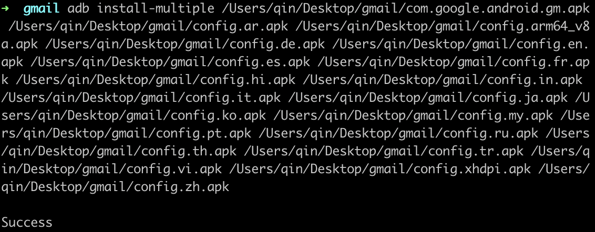

##### APK与XAPK的区别

XAPK是安卓apk安装包的一种全新的文件格式标准，其中包含所有的apk安装包和保持安卓游戏或者应用程序运行的obb数据包缓存文件，此类文件的扩展名以.xapk结束。

国内大多都是apk，而国外多是Xapk，Xapk比apk多了一个obb的数据包，也就是说你下载好以后不需要再额外下载数据了，可以直接玩。

##### 如何安装XAPK

今天在google play store安装gmail多次失败，就去apkpure网站上直接下载了gmail安装包，发现xapk格式，adb install gmail.xapk和adb install gmail.xapk都无法安装。

目前有两种安装方式：
1. 小白版：
   1. 下载 Xapk安装器，如：XAPK Installer手机版(XAPK安装器)、apkpure
   2. 使用安装器安装
2. adb版：
   1. 将xpak改成zip并解压
   2. 使用命令`adb install-multiple `，不要回车，这个时候将解压目录里面的apk文件全选，并拖到命令行，会在刚才的命令后面出现各个apk的路径，此时回车即可安装
