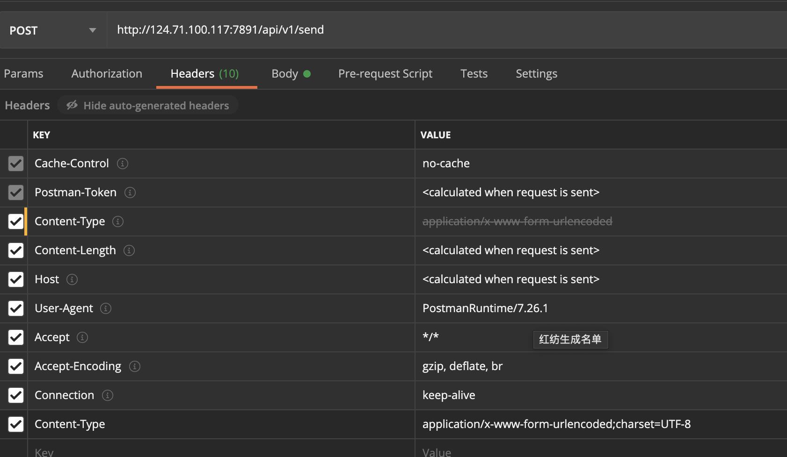
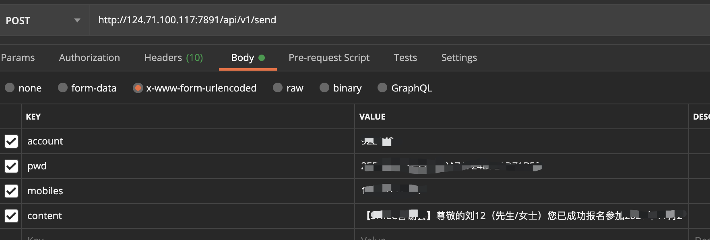

### 第三方短信
此篇仅供自己备忘。

#### 1.用户信息、接口信息
从客服处拿到
* ip
* 端口
* 用户名
* 密码
* [开发文档（可选）](短信接口文档.pdf)

#### 2.PostMan测试接口
使用postman能方便的测试接口

以发短信接口为例，只需要两部即可

1. 配置header

1. 填好参数

注意短信前面是有签名的，不加签名会授权失败

发送后可以通过`report`接口查询发送状态，`queryBalance`查询余额

### 3.服务器端逻辑
``` php
function sendSms($phone) {
    $sms="短信内容;
    $url = "http://124.71.100.117:7891/api/v1/send";
    $data = array('account'=>'账号',
             'pwd'=>'密码md5',
             'mobiles'=> $phone,
             'content'=>$sms);
    echo post2($url, $data) . "<br/>";
}

function post2($url, $data) {
    $postdata = http_build_query($data);
    $opts = array('http' => 
        array( 'method'  => 'POST','header'  => 'Content-type: application/x-www-form-urlencoded', 'content' => $postdata ) );
    $context = stream_context_create($opts);
    $result = file_get_contents($url, false, $context);
    return $result;
}
```

### 注意事项
* 请求头的Content-Type为application/x-www-form-urlencoded
* 密码需要32位md5加密
* 同一号码、同一内容发多次时，会有审核机制，需等待几分钟，若长时间没有，需联系客服