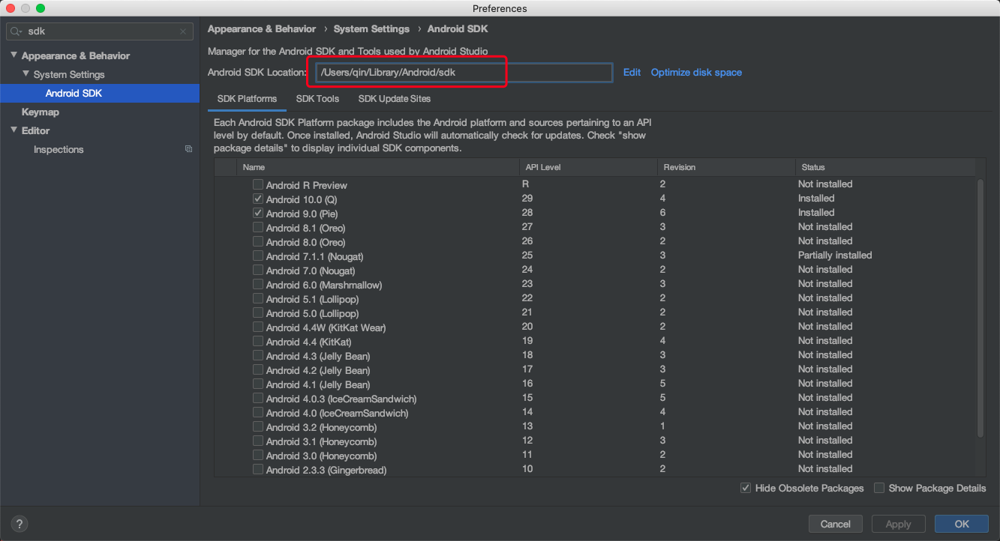

### 解决mac中zsh的 adb: command not found 问题

##### 原因

zsh没有配置Android环境变量。

##### 解决方案

打开终端，输入下列命令：
```
touch ~/.zshrc
```

如果当前没有这个文件,则会默认创建。

```
open ~/.zshrc
```
如果是第一次创建,则默认为空白的文件。

在打开的文件中输入，可以加在最后一行。

```
export ANDROID_HOME=/Users/qin/Library/Android/sdk
export PATH=${PATH}:${ANDROID_HOME}/tools
export PATH=${PATH}:${ANDROID_HOME}/platform-tools
```
这里的export ANDROID_HOME=你的安卓sdk路径。
打开android studio，使用快捷键Command + ,打开设置，如下图找到路径替换即可。



保存，随后在终端输入一下命令即可配置成功

```
source ~/.zshrc
```