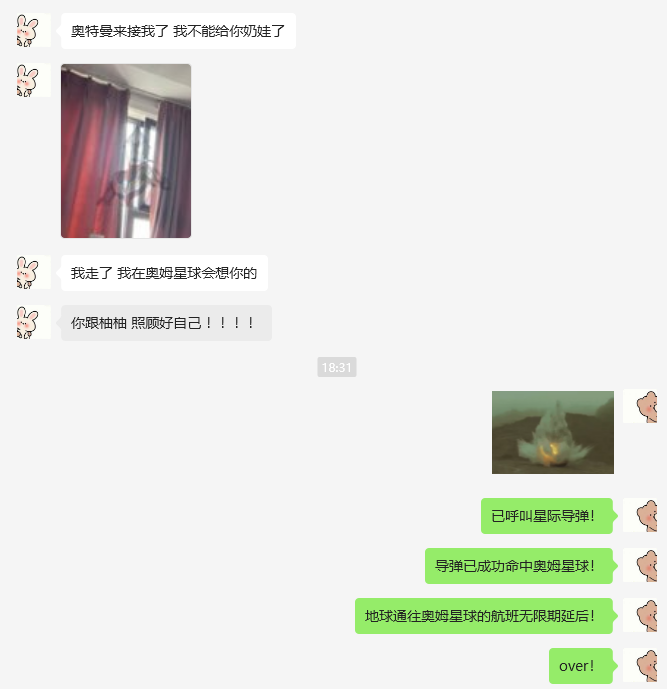

# 工作
* 调研android log有了大致的方案，被突然添加的水印工作打断了
* 借助GPT4快速学习paint的shader方法，成功把水印从简单的repeat改成旋转画布 + 每行比上一行右移1/3的的形式完成
* 将水印库上传到公司maven

# todo
* 输出水印分享blog
* 输出上传到公司maven分享文章

# 生活
* 
* 晚上和猪猪去西门打牙祭
* 把小风扇拿公司了，终于没那么热了
* 吕不韦真爽啊，和孔子搭配太屌啦